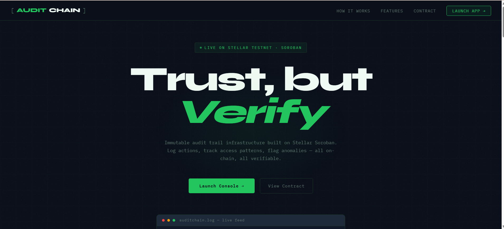
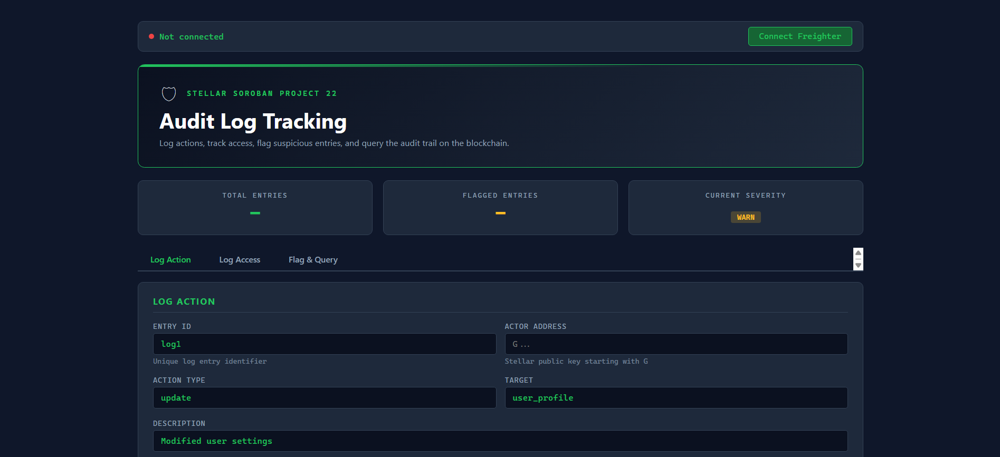
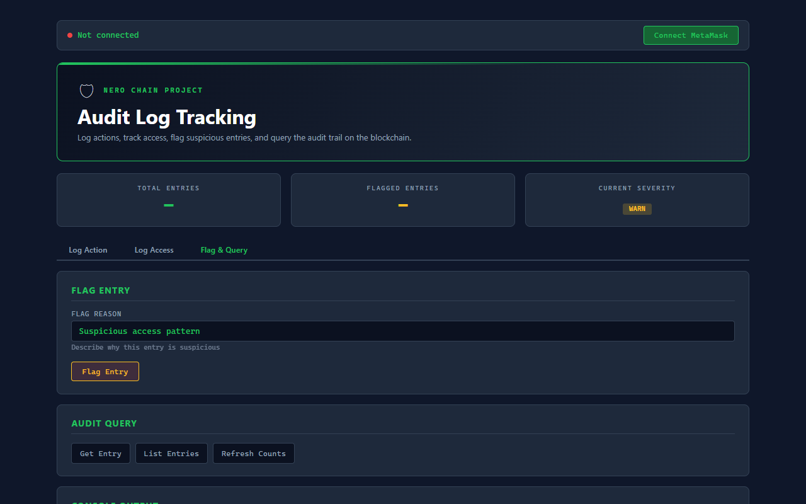

<div align="center">
  
  <h1>AuditChain</h1>
  <p><strong>Immutable Audit Logging & Security Platform on Nero Chain</strong></p>
</div>

An on-chain audit logging system built on **Nero Chain (EVM)**. AuditChain allows organizations to log critical actions, track access patterns, flag anomalies, and query the entire audit trail with the cryptographic guarantees of blockchain immutability.

---

## 🎥 Video Demonstration
Here is a quick interactive demonstration of the AuditChain frontend in action:


---

## 📋 Table of Contents
1. [Core Features](#core-features)
2. [UI Screenshots](#ui-screenshots)
3. [Architecture & Tech Stack](#architecture--tech-stack)
4. [Developer Setup Guide](#developer-setup-guide)
5. [Smart Contract Deep Dive](#smart-contract-deep-dive)
6. [Data Model & Error Codes](#data-model--error-codes)
7. [License](#license)

---

## 🚀 Core Features
- **Tamper-proof Records**: Once written to the Nero Chain, no entry can be altered or erased.
- **Real-time Flagging**: Auditors can mark suspicious entries instantly with detailed audit reasons.
- **Queryable State**: Read entry counts, flagged totals, and individual records transparently.
- **Auth-gated Writes**: Every write operation requires cryptographic signatures from actors via **MetaMask**.
- **Severity Levels 0–5**: Classify events seamlessly from informational through critical.
- **Auto-Network Switch**: Frontend automatically detects and prompts users to switch to the Nero Testnet if they are on the wrong network.

---

## 🖼 UI Screenshots
### 1. Landing Page
Showcases the marketing page, features, and contract information.


### 2. Console - Log Action Flow
The connected Web3 interface for entering audit action data (entry ID, actor, action type, target) and executing transactions.


### 3. Console - Flag and Query Flow
Workflow and query controls used to mark suspicious entries and read state directly from the blockchain.


---

## 🏗 Architecture & Tech Stack

```text
my-nero-app/
├── index.html              # Landing page
├── app.html                # Security console application
├── src/
│   ├── App.jsx             # React security console component
│   └── index.css           # Global styles and glassmorphism UI
├── lib/
│   └── nero.js             # Ethers.js integration + MetaMask handling
├── evm-contracts/          # Hardhat Smart Contract Project
│   ├── contracts/          
│   │   └── AuditLogTracking.sol # Solidity smart contract
│   ├── scripts/            
│   │   └── deploy.js       # Deployment script
│   └── hardhat.config.js   # Nero Network configuration
└── vite.config.js          # Vite build configuration
```

### Tech Stack:
- **Blockchain**: Nero Chain (EVM Testnet)
- **Smart Contract**: Solidity
- **Frontend**: React 19 + Vite
- **Web3 Interface**: Ethers.js v6
- **Wallet Support**: MetaMask
- **Development Environment**: Hardhat

---

## 🛠 Developer Setup Guide

Follow these steps to spin up the project locally.

### Prerequisites
- Node.js 18+
- npm or yarn
- MetaMask Browser Extension
- Testnet NERO (Request from Nero Chain Faucet)

### 1. Install Frontend Dependencies
```bash
npm install
```

### 2. Configure Smart Contracts
Navigate to the `evm-contracts` folder, install dependencies, and setup your `.env` file:
```bash
cd evm-contracts
npm install
```
Inside the `evm-contracts` folder, create an `.env` file with your deployer wallet private key:
```env
PRIVATE_KEY=your_private_key_here
NERO_RPC_URL=https://rpc-testnet.nerochain.io
```

### 3. Deploy Contract to Nero Testnet
Execute the Hardhat deployment script to compile and deploy the `AuditLogTracking.sol` contract to the Nero Testnet:
```bash
npx hardhat run scripts/deploy.js --network nero
```
*Copy the deployed contract address that gets printed in the terminal.*

### 4. Connect Frontend to the Contract
Open `lib/nero.js` and paste your deployed contract address:
```javascript
export const CONTRACT_ADDRESS = "0xYourDeployedAddressHere";
```

### 5. Start the Development Server
Navigate back to the root folder and start the application:
```bash
cd ..
npm run dev
```
Visit `http://localhost:5173/` to see the live app!

---

## 📜 Smart Contract Deep Dive

### Contract Methods

#### Write Operations (Requires MetaMask Signature)
- `logAction(string id, string actionType, string target, string description, uint32 severity, uint64 timestamp)`: Record a generic system action.
- `logAccess(string id, string resource, string accessType, uint64 timestamp)`: Specifically log resource access patterns (read/write).
- `flagEntry(string id, string reason)`: Mark an existing entry as suspicious.

#### Read Operations (Free, Instant Queries)
- `getEntry(string id)`: Returns the full AuditEntry struct.
- `listEntries()`: Returns an array of all recorded Entry IDs.
- `getEntryCount()`: Returns total number of logs.
- `getFlaggedCount()`: Returns total number of flagged logs.

---

## 🗄 Data Model & Error Codes

### AuditEntry Struct
```solidity
struct AuditEntry {
    address actor;        // Address that signed the tx
    string actionType;    // update, read, delete
    string target;        // Data or API path targeted
    string description;   // Human-readable rationale
    uint32 severity;      // 0-5 (5 = Critical)
    bool isFlagged;       // If true, entry is suspicious
    string flagReason;    // Why it was flagged
    string accessType;    // Scope of access
    uint64 loggedAt;      // Unix timestamp
}
```

### Custom Errors
- `InvalidDescription()`
- `InvalidTimestamp()`
- `InvalidSeverity()`
- `EntryAlreadyExists()`
- `EntryNotFound()`
- `AlreadyFlagged()`

---

## 📄 License
MIT License - Feel free to build upon this project for any hackathon or production use!
